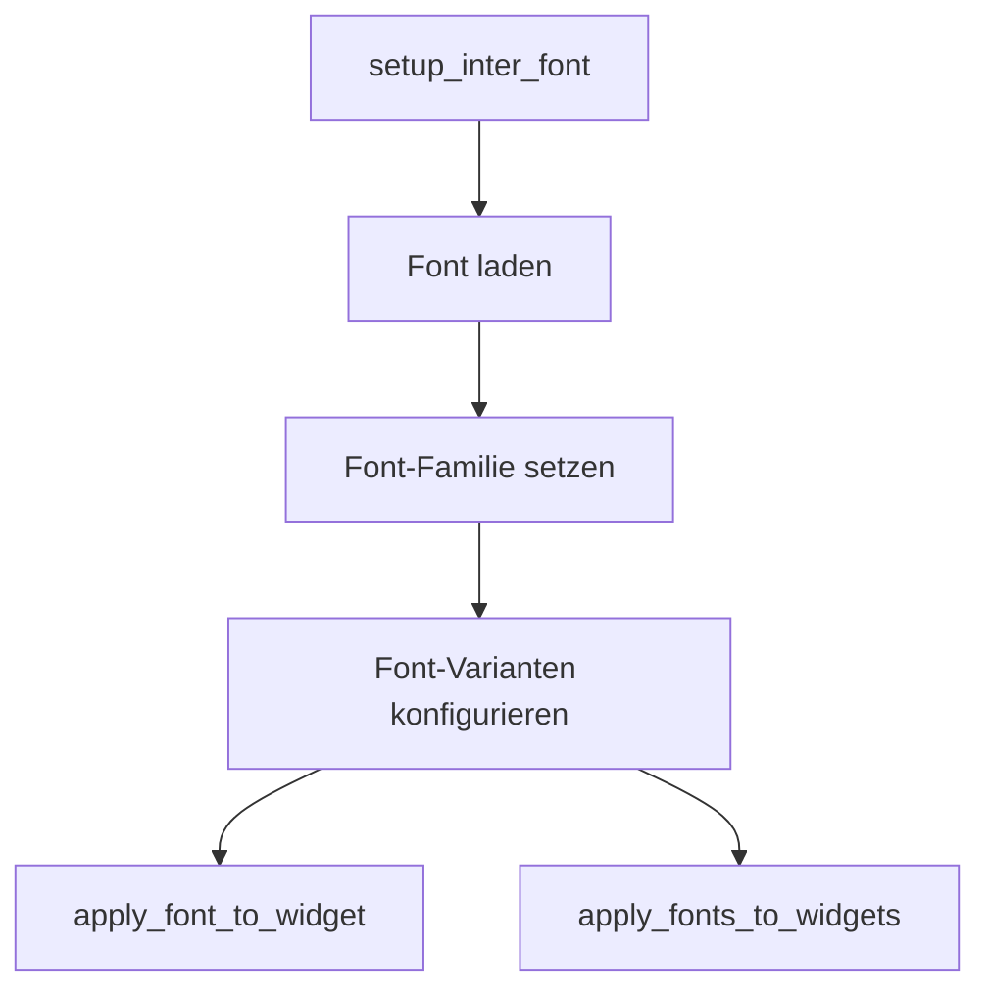

# Modul-Dokumentation: `font_manager.py`

## Modulbeschreibung

Das Modul `font_manager.py` verwaltet die Integration, Konfiguration und Anwendung der Inter Font in der gesamten Anwendung. Es sorgt für ein konsistentes und professionelles UI-Design, indem verschiedene Font-Varianten für unterschiedliche UI-Bereiche bereitgestellt und auf Widgets angewendet werden.

## Beteiligte Module & Services

- **Externe Module:**
  - `PySide6.QtGui.QFont`, `QFontDatabase`: Font-Objekte und Font-Registrierung.
  - `PySide6.QtWidgets.QApplication`: Anwendungskontext für das Setzen der Standard-Font.
  - `loguru`: Logging.
  - `os`: Dateisystemoperationen.
- **Interne Module:**
  - Keine weiteren internen Services, aber als Singleton `font_manager` verfügbar.

## Workflows

### Font-Setup und Anwendung

1. **Initialisierung:**
    - Konstruktor erstellt FontManager-Instanz.

2. **Font-Setup:**
    - `setup_inter_font()` lädt alle statischen Inter-Fonts aus dem Ressourcenverzeichnis.
    - Setzt die Standard-Font für die Anwendung.
    - Konfiguriert verschiedene Font-Varianten für UI-Bereiche.

3. **Font-Anwendung:**
    - `apply_font_to_widget()` und `apply_fonts_to_widgets()` wenden die Font-Varianten auf Widgets an.
    - Über Convenience-Funktionen können Fonts abgerufen und gesetzt werden.



## Verarbeitete Datentypen und Datenstrukturen

### Eingaben

- Keine externen Eingaben, aber Methoden erwarten:
  - `widget`: Ziel-Widget für Font-Anwendung
  - `variant`: Name der Font-Variante

### Verarbeitete Daten

- `font_family: str | None`: Name der geladenen Font-Familie
- `font_variants: Dict[str, QFont]`: Mapping von Variantennamen zu QFont-Objekten
- Methoden: `setup_inter_font()`, `apply_font_to_widget()`, `apply_fonts_to_widgets()`, `get_font()`, `get_available_variants()`, `is_inter_loaded()`

### Ausgaben

- Fonts werden auf Widgets angewendet
- Standard-Font für die Anwendung gesetzt
- Logging von Status und Fehlern

## Beispiel: Verwendung

```python
from yt_database.gui.components.font_manager import font_manager

font_manager.setup_inter_font()
font_manager.apply_font_to_widget(widget, "ui_default")
```

## Typdefinition (Auszug)

```python
class FontManager:
    def __init__(self) -> None:
        ...
    def setup_inter_font(self) -> bool:
        ...
    def apply_font_to_widget(self, widget, font_variant: str = "ui_default") -> None:
        ...
    def apply_fonts_to_widgets(self, widgets_dict: Dict[str, Any]) -> None:
        ...
```

---
