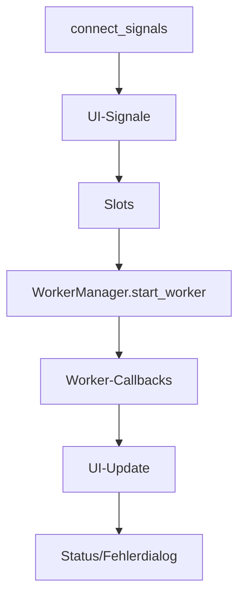

# Modul-Dokumentation: `signal_handler.py`

## Modulbeschreibung

Das Modul `signal_handler.py` ist für die zentrale Verwaltung und Verbindung aller Signals und Slots zwischen den GUI-Komponenten und den Hintergrund-Services der Anwendung zuständig. Es sorgt dafür, dass Benutzerinteraktionen, Statusänderungen und Workflow-Aktionen korrekt und konsistent verarbeitet werden. Die Klasse `SignalHandler` übernimmt die Rolle eines Vermittlers zwischen UI-Widgets und Worker-Services.

## Beteiligte Module & Services

- **Externe Module:**
  - `PySide6.QtCore.QObject`, `Slot`: Qt-Signal/Slot-Mechanismus.
  - `PySide6.QtWidgets.QMessageBox`: Dialoge für Benutzerinteraktion.
  - `loguru`: Logging.
  - `os`: Dateisystemoperationen.
- **Interne Module:**
  - `yt_database.config.settings`: Zugriff auf Einstellungen.
  - `yt_database.gui.web_view_window`: Anzeige von Webinhalten.
  - `yt_database.gui.main_window`: Hauptfenster.
  - `yt_database.gui.components.worker_manager`: Verwaltung von Worker-Threads.
  - `yt_database.services.*_worker`: Verschiedene Worker für Batch-Transkription, Channel-Videos, Kapitelgenerierung.
  - `yt_database.services.service_factory`: Factory für Service-Instanzen.
  - `yt_database.database`: Datenbankoperationen für Transkripte.
  - `yt_database.services.analysis_prompt_service`: Prompt-Auswahl für Analyse.

## Workflows

### Signal-Verbindung und Workflow-Steuerung

1. **Initialisierung:**
    - Konstruktor erhält Referenzen auf MainWindow, ServiceFactory und WorkerManager.

2. **Signalverbindung:**
    - `connect_signals()` verbindet alle relevanten UI-Signale mit den passenden Slots.
    - Navigation, Aktionen, Widget-Events, Toolbar, Explorer, Log, Sidebar, etc.

3. **Worker-Management:**
    - Startet und überwacht verschiedene Worker (Batch, Single, Channel, Kapitel).
    - Verbindet Worker-Callbacks mit UI-Updates und Statusanzeigen.

4. **Fehler- und Statusbehandlung:**
    - Zeigt Bestätigungsdialoge, Statusmeldungen und Fehler an.
    - Aktualisiert UI nach Abschluss oder Fehler von Workern.



## Verarbeitete Datentypen und Datenstrukturen

### Eingaben

- `main_window: MainWindow` (enthält alle UI-Komponenten)
- `service_factory: ServiceFactory` (liefert Backend-Services)
- `worker_manager: WorkerManager` (verwaltet Worker-Threads)
- Diverse Signal- und Slot-Parameter (z.B. Video-IDs, Pfade, Prompts)

### Verarbeitete Daten

- Instanzen von Widgets und Workern:
  - `SidebarWidget`, `DashboardWidget`, `BatchTranscriptionWidget`, `DatabaseOverviewWidget`, `SearchWidget`, `LogWidget`, `ConfigDialog`, `ExplorerWidget`, `WebEngineWindow`
  - Worker: `BatchTranscriptionWorker`, `ChannelVideoWorker`, `ChapterGenerationWorker`, etc.
- Datenbankmodelle: `Transcript`
- Status- und Fehlerobjekte
- Prompt-Typen und Texte

### Ausgaben

- UI-Updates (z.B. Fortschrittsanzeigen, Statusmeldungen, Dialoge)
- Start, Stop und Überwachung von Workern
- Datenbank-Updates
- Weiterleitung von Daten zwischen Widgets und Services

## Beispiel: Signal-Verbindung

```python
from yt_database.gui.components.signal_handler import SignalHandler

signal_handler = SignalHandler(main_window, service_factory, worker_manager)
signal_handler.connect_signals()
```

## Typdefinition (Auszug)

```python
class SignalHandler(QObject):
    def __init__(self, main_window: MainWindow, service_factory: ServiceFactory, worker_manager: WorkerManager):
        ...
    def connect_signals(self):
        ...
```

---
