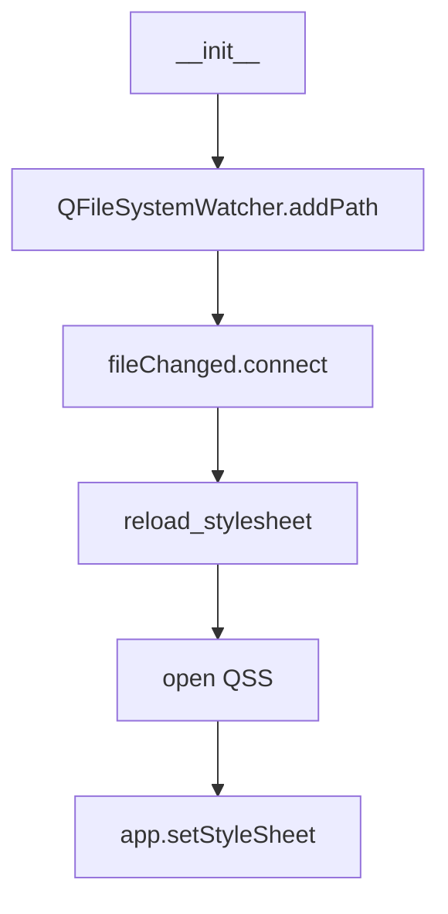

# Modul-Dokumentation: `style_manager.py`

## Modulbeschreibung

Das Modul `style_manager.py` verwaltet das Laden und Live-Neuladen des Anwendungs-Stylesheets (QSS) für die gesamte GUI. Es sorgt dafür, dass Designänderungen an der Stylesheet-Datei sofort und automatisch auf die Anwendung angewendet werden, ohne einen Neustart zu erfordern.

## Beteiligte Module & Services

- **Externe Module:**
  - `PySide6.QtCore.QFileSystemWatcher`, `QObject`, `Slot`: Für das Beobachten von Dateiänderungen und die Qt-Objekthierarchie.
  - `PySide6.QtWidgets.QApplication`: Anwendungskontext für das Setzen des Stylesheets.
  - `loguru`: Logging für Status- und Fehlerausgaben.
- **Interne Module:**
  - `yt_database.config.settings.STYLESHEET_FILE`: Pfad zur QSS-Datei.

## Workflows

### Live-Reload des Stylesheets

1. **Initialisierung:**
    - Prüft, ob die Stylesheet-Datei existiert.
    - Fügt die Datei dem `QFileSystemWatcher` hinzu.
    - Verbindet das Signal `fileChanged` mit der Methode `reload_stylesheet`.

2. **Stylesheet laden:**
    - Liest die QSS-Datei und setzt sie als Stylesheet für die Anwendung.
    - Bei Änderungen wird das Stylesheet automatisch neu geladen.

3. **Fehlerbehandlung:**
    - Loggt Warnungen, falls die Datei nicht existiert oder nicht gelesen werden kann.



## Verarbeitete Datentypen und Datenstrukturen

### Eingaben

- `app: QApplication` (Anwendungskontext)
- `parent: QObject | None` (Qt-Objekthierarchie)

### Verarbeitete Daten

- `QFileSystemWatcher`: Überwacht die QSS-Datei auf Änderungen.
- `STYLESHEET_FILE`: Pfad zur QSS-Datei.
- Methoden: `reload_stylesheet()`

### Ausgaben

- Setzt das Stylesheet der Anwendung dynamisch.
- Loggt Status- und Fehlerausgaben.

## Beispiel: Verwendung

```python
from yt_database.gui.components.style_manager import StyleManager

style_manager = StyleManager(app)
```

## Typdefinition (Auszug)

```python
class StyleManager(QObject):
    def __init__(self, app: QApplication, parent=None):
        ...
    @Slot()
    def reload_stylesheet(self):
        ...
```

---
