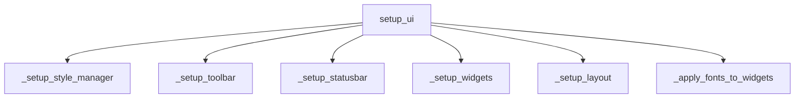

# Modul-Dokumentation: `ui_manager.py`

## Modulbeschreibung

Das Modul `ui_manager.py` verwaltet die Erstellung, Initialisierung und das Layout aller UI-Komponenten des Hauptfensters der Anwendung. Es orchestriert die Einbindung und Konfiguration von Widgets, Toolbar, Statusbar, Layouts und Styles und sorgt für eine konsistente und flexible Benutzeroberfläche.

## Beteiligte Module & Services

- **Externe Module:**
  - `PySide6.QtWidgets`, `PySide6.QtGui`: Für GUI-Elemente wie Toolbar, Layouts, Widgets, Actions.
  - `loguru`: Logging.

- **Interne Module:**
  - `yt_database.config.settings`: Zugriff auf Projektpfade und Einstellungen.
  - `yt_database.gui.components.style_manager`: Dynamisches Laden und Anwenden von Stylesheets.
  - `yt_database.gui.utils.icons`: Icon-Management.
  - Diverse Widget-Module:
    - `batch_transcription_control_widget`, `config_dialog`, `dashboard_widget`, `database_table_view_widget`, `log_widget`, `projects_tree_view_widget`, `search_widget`, `sidebar_widget`, `text_file_editor_widget`
  - `yt_database.resources.icons_rc`: Ressourcen für Icons.
  - `yt_database.gui.components.font_manager`: Schriftartenverwaltung (nur bei TYPE_CHECKING).
  - `yt_database.gui.main_window`: Hauptfenster (nur bei TYPE_CHECKING).
  - `yt_database.services.service_factory`: Service-Factory für Backend-Services (nur bei TYPE_CHECKING).

## Workflows

### Initialisierung des UI

1. **StyleManager initialisieren**
2. **Toolbar erstellen und konfigurieren**
3. **Statusbar einrichten**
4. **Widgets initialisieren**
5. **Layout aufbauen**
6. **Schriftarten anwenden**

### Ablauf (Stichpunkte)

- `setup_ui()` orchestriert den gesamten Ablauf.
- Widgets werden als Attribute am `main_window` gesetzt.
- Layout wird mit `QSplitter` und `QHBoxLayout` erstellt.
- Toolbar und Statusbar werden mit Icons und Actions versehen.
- StyleManager sorgt für dynamisches Styling.



## Verarbeitete Datentypen und Datenstrukturen

### Eingaben

- `main_window: MainWindow` (enthält alle UI-Komponenten)
- `service_factory: ServiceFactory` (liefert Backend-Services)
- `font_manager: FontManager` (verwaltet Schriftarten)

### Verarbeitete Daten

- Instanzen von Widgets:
  - `SidebarWidget`, `DashboardWidget`, `ProjectTreeWidget`, `DatabaseOverviewWidget`, `BatchTranscriptionWidget`, `SearchWidget`, `LogWidget`, `TextFileEditorWidget`, `ConfigDialog`
- Layouts: `QHBoxLayout`, `QSplitter`, `QStackedWidget`, `QToolBar`, `QWidget`
- StyleManager-Instanz
- Dictionary für Widget-Schriftarten

### Ausgaben

- Initialisiertes und konfiguriertes Hauptfenster mit allen UI-Komponenten als Attribute
- Toolbar mit Actions und Icons
- Statusbar mit Statusmeldung
- Dynamisch angewendete Styles und Schriftarten

## Beispiel: Initialisierung

```python
from yt_database.gui.components.ui_manager import UiManager

ui_manager = UiManager(main_window, service_factory, font_manager)
ui_manager.setup_ui()
```

## Typdefinition (Auszug)

```python
class UiManager:
  def __init__(self, main_window: MainWindow, service_factory: ServiceFactory, font_manager: FontManager):
    self.main_window = main_window
    self.service_factory = service_factory
    self.font_manager = font_manager
    self.style_manager: StyleManager | None = None
```

---
